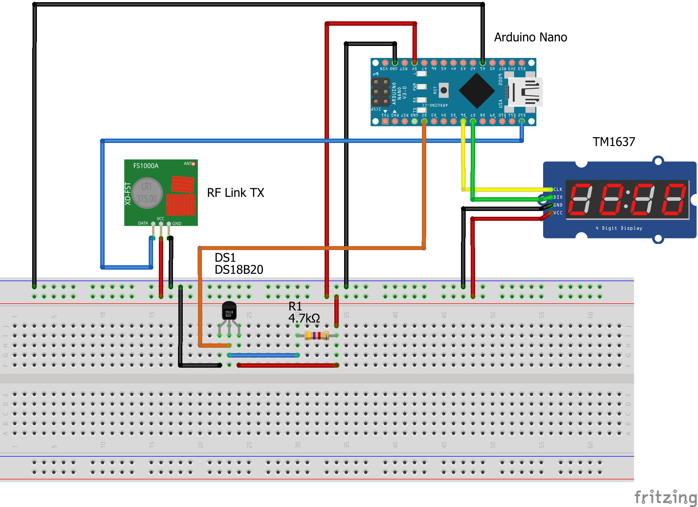
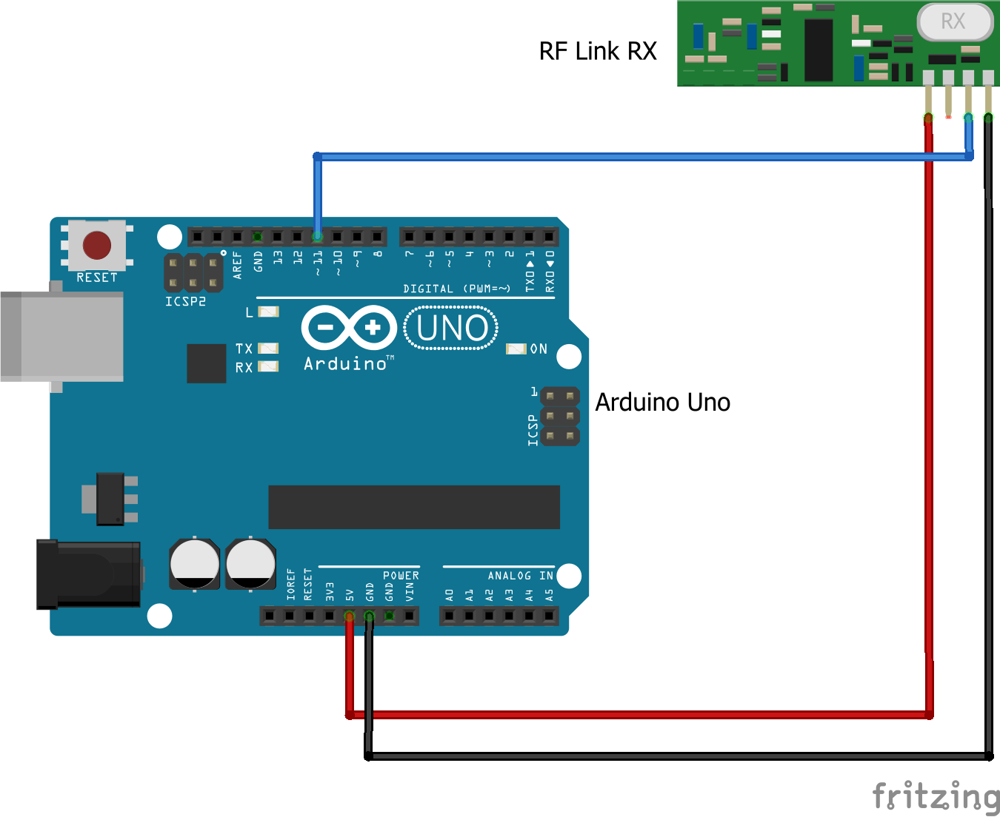

# arduino-remote-temp

Get temperature with an Arduino and send it to an other Arduino over an 433Mhz connection.
On the second Arduino you can activate the monitor to print the sent stuff.

## Setup

**Sender**
-	Arduino Nano
-	Temperature sensor – DS18B20 1-Wire
-	Sender 433Mhz – RF-Link-TX
-	Anzeige – TM1637
-	4.7 kΩ resistance

**Receiver**
-	Arduino Uno
-	Receiver 433Mhz – RF-Link-RX

**Required Libraries**
- [RadioHead](http://www.airspayce.com/mikem/arduino/RadioHead) [Download](http://www.airspayce.com/mikem/arduino/RadioHead/RadioHead-1.91.zip)
- SPI
- OneWire
- DallasTemperature
- TM1637Display

## Configuration

**Sender**

The sender connects the sender component, the temperature sensor and the display.

**Receiver**

The receiver connects just the receiver component.

**Optional Config**

Over the analog pins A0 to A7 it's possible to define the `DeviceID`.
This pins work like a jumper and you can just connect them to the GND to define the ID.

## Sample

If you start the monitor on on your receiver Arduino you will get an output like this:

    23:17:45.989 -> gmonit;6;2593
    23:17:45.989 -> Device: 6  - Temperature: 2593
    23:18:06.814 -> gmonit;6;2587
    23:18:06.814 -> Device: 6  - Temperature: 2587

